# Hi, I'm Robin

I am transitioning from QA and Test Engineering into Data Science and Analytics.
Currently I am studying Data Science & AI at [WBS Coding School](https://www.wbscodingschool.com/) and building projects that combine analysis, structure, and practical usability.

- :bar_chart: Focus: data analytics, predictive analytics and machine learning
- :gear: Background: 10+ years in QA, test automation and CI/CD workflows
- :round_pushpin: Based in Leipzig, Germany

---

## :telescope: What I'm Working On

- Building a portfolio with projects that solve real problems and are easy to understand
- Strengthening my skills in Python, SQL, statistics and machine learning
- Bringing a QA mindset into data work: clear structure, reproducibility and data quality

---

## :toolbox: Core Tech Stack

Also working with: NumPy, matplotlib, seaborn, SQLAlchemy, APIs, JSON, Data Lake, Synapse

---

## :star: Featured Projects

### :speech_balloon: Leipzig Expert: a RAG Chatbot

A Retrieval-Augmented Generation chatbot that grounds a local LLM in a Leipzig knowledge base, so every answer is built from retrieved sources instead of the model's memory. It includes a streaming FastAPI web UI, a CLI and a custom LLM-as-judge evaluation.

:arrow_right: [github.com/Robin-Reiche/leipzig-rag-chatbot](https://github.com/Robin-Reiche/leipzig-rag-chatbot)

### :jigsaw: CSV Grid Editor for VS Code

A Visual Studio Code extension for viewing and editing CSV and TSV files in a sortable, filterable grid directly inside the editor.
It focuses on usability features such as inline editing, undo/redo, column resizing and theme integration.

:arrow_right: [github.com/Robin-Reiche/csv-grid-editor](https://github.com/Robin-Reiche/csv-grid-editor)

### :bar_chart: Eniac Discount Strategy Analysis

A business-focused analysis project that examines whether discounts increase revenue for a tech retailer.
The work includes data cleaning, merging multiple sources, exploratory analysis and result communication.

:arrow_right: [github.com/Robin-Reiche/eniac-discount-strategy](https://github.com/Robin-Reiche/eniac-discount-strategy)

### :headphones: Moosic Playlist Clustering

A capstone project exploring whether Spotify's audio features alone can group ~5,000 songs into playlists automatically.
We tested DBSCAN for outlier detection and K-Means for clustering, narrowed 9 features down to 4 based on correlation and skewness analysis, and evaluated the resulting 46 playlists through silhouette scores and manual inspection.

:arrow_right: [github.com/Robin-Reiche/music_playlist_clustering_spotify](https://github.com/Robin-Reiche/music_playlist_clustering_spotify)

### :books: Liane's Library Management System

A full-stack library management app for tracking books, borrowers and loan history.
This project helped me build hands-on experience with CRUD workflows, database structure and application logic.

:arrow_right: [github.com/Robin-Reiche/lianes-library](https://github.com/Robin-Reiche/lianes-library)

---

## :mortar_board: Certifications

- PCEP, Python Certified Entry-Level Programmer (2025)
- ISTQB Certified Tester Foundation Level (2021)
- Scikit-learn Associate Practitioner (2026)

---

## :chart_with_upwards_trend: GitHub Stats

---

## :mailbox_with_mail: Get in Touch

